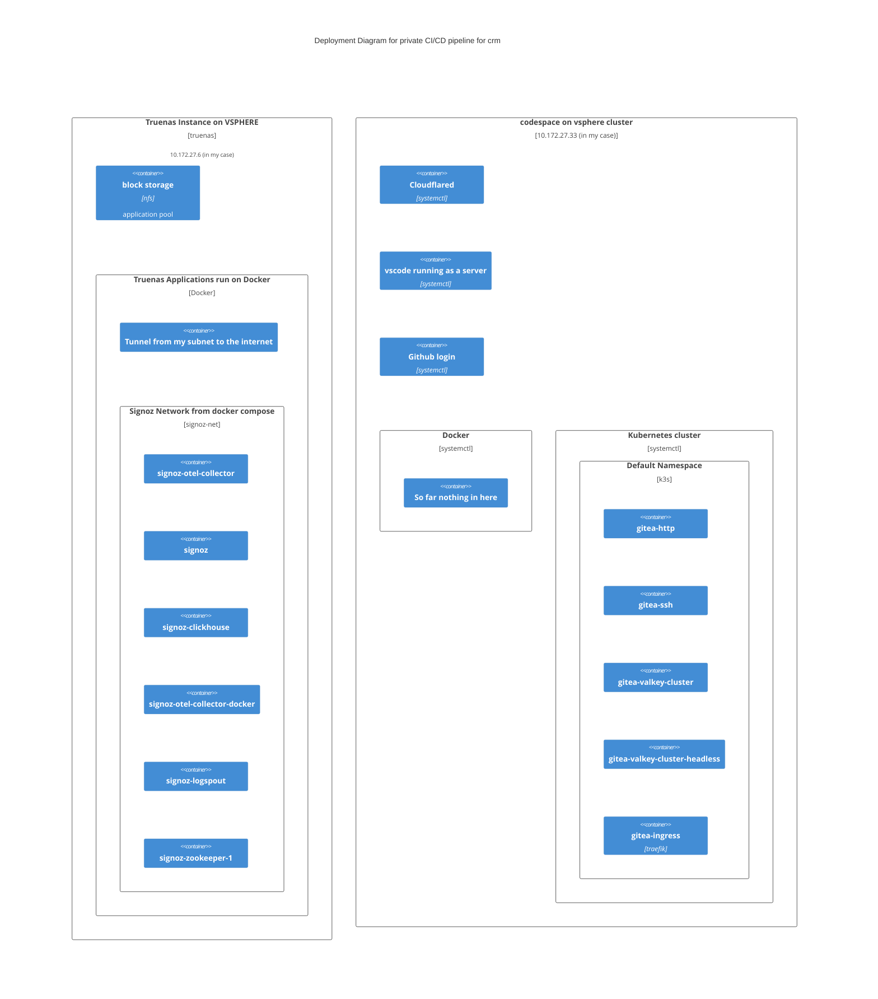

# cdevops-jenkins
k8s lab to install jenkins and use it from github and gitea

TLDR;

```bash
ansible-playbook up.yaml
```

This is intended to be run on a machine with access to a kubernetes cluster, It also may be helpful to use docker for this part. If you are using this for class you should have to vsphere virtual machines. 1 will have truenas on it, the other stock ubuntu with support for a codespace.

In assignment 3 you added gitea to your kubernetes cluster



Your job is to edit the up.yaml to add jenkins to your cluster and down.yaml to remove it. You will also need to expose jenkins with the ngrok or traefik and cloudflare ingress, as you did with the previous assignment.

### Points to Cover

## Marking

|Item|Out Of|
|--|--:|
|use [this article](https://www.digitalocean.com/community/tutorials/how-to-install-jenkins-on-kubernetes) and [this documentation](https://docs.ansible.com/ansible/latest/collections/kubernetes/core/k8s_module.html) to create an up.yaml that installs jenkins or other runner on your cluster|2|
|create a down.yaml that makes the resources created by up.yaml absent. (you will need to reverse the order)|2|
|Use [this article](https://www.jenkins.io/doc/tutorials/build-a-python-app-with-pyinstaller/) to create a 2nd (test) repository containing a Jenkinsfile or actions file|2|
|push this repository to github and configure it to run the pipeline|2|
|push this repository to gitea and configure gitea to run the pipeline on your cluster|2|
|||
|total|10|

Submit a link to a repository in one of your accounts, started from this repository, with your up.yaml and down.yaml for running jenkins on your cluster. Be sure to document what you did in the README.md
